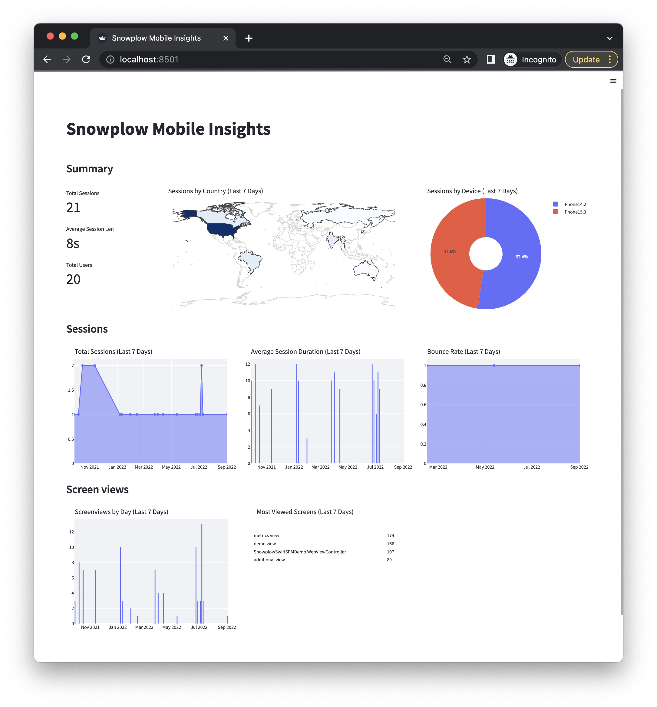

+++
title = "Streamlit"
post = ""
weight = 1
+++

Streamlit uses Python to build shareable dashboards without the need for front-end development experience.

Download the `streamlit-visualisation` project template and copy the unzipped folder to your project directory to get started.

{}
{}

#### **Step 1:** Install requirements
Run the command below to install the project requirements and run the virtual environment

❗❗ **This implementation has been tested with the following dependencies: *python=3.9.13, streamlit=1.12.0, snowflake-connector-python==2.7.9*. If you run into package compatibility issues or encounter any errors try using them to build your own environment.**


```bash
pipenv install
pipenv shell
```

#### **Step 2:** Set-up Database Connection

Open `secrets.toml` and add your Snowflake account and database details.
{}
Ensure `secrets.toml` is in `.gitignore` to keep your information safe.
{}

```toml
# .streamlit/secrets.toml

[snowflake]
user = "xxx"
password = "xxx"
account = "xxx"
database = "xxx"
schema = "xxx"
warehouse = "xxx"
role = "xxx"
```

#### **Step 3:** Run the Streamlit dashboard

Run the command below to run the streamlit locally

```bash
streamlit run Dashboard.py
```

{}
In case the dashboard does not load due to errors such as 'This session does not have a current database. Call 'USE DATABASE', or use a qualified name.' a possible workaround is to assign default ROLE to the Snowflake user that could handle this.
{}


